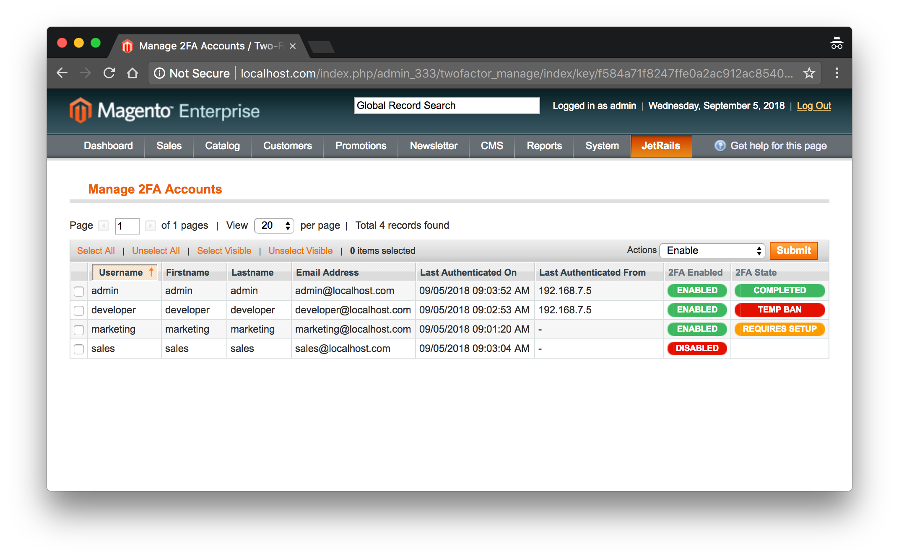

# Magento — Two-Factor Authentication
> The JetRails 2FA plugin adds an extra layer of security to your Magento store. User based 2FA enablement ensures that admin users are following best security practices.

	

## About
This module is available on the <a href="https://marketplace.magento.com/jetrails-jetrails-twofactor.html" ><b>Magento Marketplace</b></a>. The JetRails 2FA plugin adds an extra layer of security to your Magento store.  User-based 2FA enablement ensures that admin users are following best security practices. This module has the following features:

- A Master Administrator can require 2FA to be utilized by specific users.
- Usage of 2FA can be enforced and required for log in.
- Once you use the 2FA to log in, there is an option to bypass authentication for a pre-configured number of days.
- A Master Administrator can oversee every user's authentication process.
- In the event of a lost or misplaced 2FA account, backup codes are available as an alternate method for authentication.
- In the event of an attempted account breach, prevention protocols are in place via brute-force protection, which will temporarily block the account.
- The threshold for the number of failed authentication attempts before a temporary ban is imposed is configurable.
- The duration of a user's temporary ban is configurable.
- An automatic instantaneous alert will be sent to the account owner and store admins informing them of an attempted breach. Any security warning will be logged with any relevant data such as the offender's IP address.
- The 2FA account can be setup for devices (something they have) using the Google Authenticator app, which is available for every platform including <a href="https://itunes.apple.com/us/app/google-authenticator/id388497605" >iPhone</a> and <a href="https://play.google.com/store/apps/details?id=com.google.android.apps.authenticator2" >Android</a>.

## Compatibility
Please refer to [COMPATIBILITY.md](COMPATIBILITY.md) to see which versions of Magento this extension was tested on and proved to be compatible with.

## Documentation
The user guide can be found in the [docs](docs) folder.  The user guide goes through the installation process as well as explains all the features that comes with this plugin. For furthur support, please email [development@jetrails.com](mailto://development@jetrails.com).

## Build System
This extension uses __Gulp__ as it's build system.  Gulp is a package that can be easily downloaded using __NPM__ or __Yarn__.  Once this repository is cloned, run `npm install gulp -g` followed by `npm install` or `yarn install` to install Gulp and all Gulp modules used within this build system.  Please refer to the following table for a description of some useful Gulp commands. A typical Gulp command takes the following form: `gulp <command>`.

| Command   | Description                                                                             |
|-----------|-----------------------------------------------------------------------------------------|
|   `init`  | Creates build, staging, and distribution directories                                    |
|  `clean`  | Deletes build and distribution directories                                              |
|   `bump`  | Bumps version number in source files to reflect version found in package.json           |
|  `build`  | Builds and copies files from source directory to the build directory                    |
|  `deploy` | Copies files from build directory to the staging directory                              |
|  `watch`  | Watches files in source directory and executes `deploy` on file change                  |
| `package` | Updates package.xml with file hashes and packages extension into distribution directory |

## Docker Environment
This project comes with a [docker-compose.yml](docker-compose.yml) and a [docker-sync.yml](docker-sync.yml) file, which can be used to spin up a Magento 1 development environment. In order to use docker, please make sure you have **Docker**, **Docker Compose**, and **Docker Sync** installed. For information about configuring this docker environment, please refer to it's Github repository which can be found [here](https://github.com/jetrails/docker-magento-alpine).
